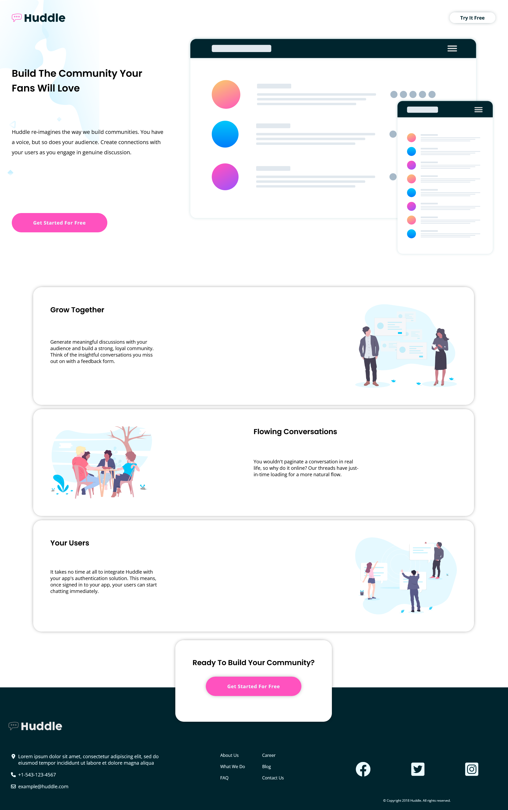

# Frontend Mentor - Huddle landing page with alternating feature blocks solution

This is a solution to the [Huddle landing page with alternating feature blocks challenge on Frontend Mentor](https://www.frontendmentor.io/challenges/huddle-landing-page-with-alternating-feature-blocks-5ca5f5981e82137ec91a5100).

## Table of contents

- [Overview](#overview)
  - [The challenge](#the-challenge)
  - [Screenshot](#screenshot)
  - [Links](#links)
- [My process](#my-process)
  - [Built with](#built-with)
  - [What I learned](#what-i-learned)
- [Author](#author)


## Overview

### The challenge

Users should be able to:

- View the optimal layout for the site depending on their device's screen size
- See hover states for all interactive elements on the page
### Screenshot




### Links

- Solution URL: [Github Repo Link](https://github.com/Ambrish-Abhijatya/huddleLandingPage-FrontEndMentor)
- Live Site URL: [Netlify Site Link](https://your-live-site-url.com)

## My process

### Built with

- Semantic HTML5 markup
- CSS custom properties
- CSS Grid
- Flexbox
- Mobile-first workflow


### What I learned

Negative margins inside a flex container combined with a z-index are an easy hack to overlap elements.

```html
  <div class="flex-container">
    <div class="card-2">
      ...
    </div>

    <footer>
      ...
    </footer>
  </div>
```

```css
.flex-container {
  display: flex;
  flex-direction: column;
}

.card-2 {
    
    ...

    margin-bottom: -8rem;
    z-index: 99999999;
}

.footer {
  ...
}


```


## Author

- Website - [Ambrish Abhijatya](https://github.com/Ambrish-Abhijatya)
- Frontend Mentor - [@Ambrish-Abhijatya](https://www.frontendmentor.io/profile/Ambrish-Abhijatya)

